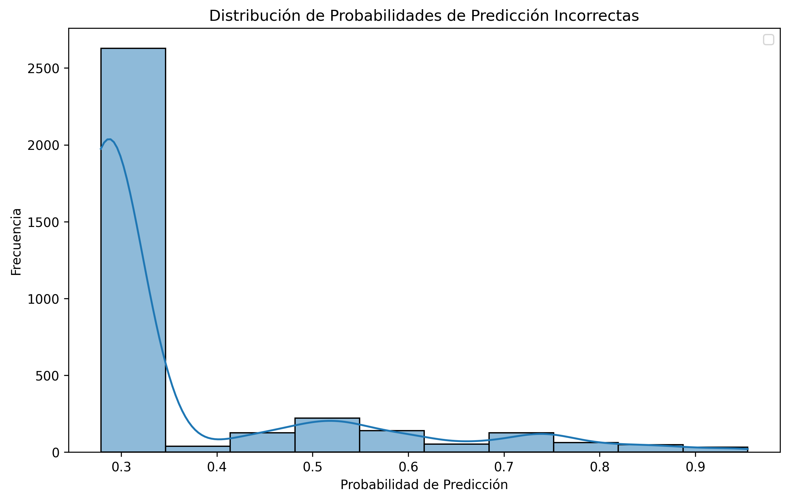

# 📝 Text Classification using Multiple ML Models

## 📚 Project Overview

This project implements and compares different Machine Learning models for text classification tasks, using a Twitter dataset sourced from Kaggle. The main goal is to predict the sentiment of tweet responses and analyze the performance of various ML techniques.

---

## 🚀 Objectives

- Explore and preprocess real-world text data.
- Train, compare, and visualize the performance of several classification models.
- Generate useful insights for future applications in sentiment analysis and NLP.

---

## 🏗️ Project Structure
```
Text-Classification/
│
├── .env/ # Environment variables (optional)
├── utils/ # Utility functions and helpers
│
├── config/ # Configuration and global resources
│ ├── pycache/ # Python cache files
│ ├── constants.py # Global constants and paths
│ └── kaggle.json # Kaggle API authentication token
│
├── data/ # Raw and processed data
│ ├── twitter_training.csv # Training dataset
│ ├── twitter_validation.csv # Validation dataset
│ └── twitter-entity-sentiment-analysis.zip # Original source (optional)
│
├── images/ # Generated visualizations
│ ├── Distribution_Probabilities_Incorrect.png
│ ├── Distribution_Probabilities_Predicted_Class.png
│ ├── image_1.png
│ ├── image_2.png
│ ├── image_3.png
│ ├── image_4.png
│ ├── image_5.png
│ ├── Model_metrics.png
│ └── sentiment_by_entity.png
│
├── .gitignore # Files/folders ignored by git
├── README.md # Main project documentation
├── requirements.txt # Python libraries and dependencies
└── Text Classification.ipynb # Main project notebook
```


## 🧩 Folder and File Descriptions

- **config/**  
  Project configuration files, credentials, and global constants.

- **data/**  
  Contains the datasets used for training and validating the models.

- **images/**  
  Stores all the charts and visualizations generated during model analysis and evaluation.

- **utils/**  
  Auxiliary functions for preprocessing and analysis, imported in the main notebook.

- **requirements.txt**  
  List of required dependencies to run the project (`scikit-learn`, `pandas`, `matplotlib`, etc.).

- **Text Classification.ipynb**  
  The main notebook containing the full workflow: analysis, training, and visualization.

---

## 🛠️ Technologies and Libraries Used

- **Python 3.x**
- **Pandas** and **NumPy**: Data manipulation and analysis
- **scikit-learn**: Machine Learning models and evaluation
- **Matplotlib** and **Seaborn**: Data visualization
- **Jupyter Notebook**

---

## 📈 Project Workflow

1. **Data loading and exploration:**  
  Import datasets and perform exploratory analysis to understand the distribution and features of the text data.

  

3. **Preprocessing:**  
  Clean data, normalize text, tokenize, and vectorize (CountVectorizer, TF-IDF, etc.).


5. **Model training:**  
  Multiple classic ML models are trained and compared for text classification, including:
  - Logistic Regression
  - Naive Bayes
  - Support Vector Machines (SVM)
  - Random Forest
  - XGBoost (optional)

4. **Evaluation and visualization:**  
  Key metrics such as accuracy, precision, recall, and f1-score; visualization of confusion matrices and prediction distributions.

  

6. **Conclusions:**  
  Analysis of results and recommendations on which model is most robust for this type of data.

---

## 🏆 Key Results

- Clear performance comparison among classic text classification models.
- Intuitive visualizations to understand each model's strengths and weaknesses.
- Recommendations for future use and improvements of NLP models in both Spanish and English.

 The following visualizations provide a comprehensive overview of the performance of the text classification model. These plots offer valuable insights into how the model assigns prediction probabilities and how they correlate with correct and incorrect classifications.

### 📊 **Probability Distribution of Incorrect Predictions**
This plot illustrates how the model assigns different probability scores to its incorrect predictions.

- X-axis (Prediction Probability): Represents the confidence score assigned by the model to each prediction.

 - Y-axis (Frequency): Indicates how frequently each range of probability values occurs among incorrect predictions.

The chart reveals that most misclassifications are associated with lower probability values, typically around 0.3, suggesting the model tends to be less confident when it makes a mistake. However, there are also instances of incorrect predictions with high confidence scores, indicating that the model can occasionally be overconfident in its wrong decisions — a potential area for improvement.



### 📈 Probability Distribution by Prediction Outcome (Correct vs. Incorrect)

This second plot compares the probability distributions for correct and incorrect predictions.

Orange Curve (Correct): Represents the distribution of probabilities for predictions the model classified correctly.

Blue Curve (Incorrect): Represents the distribution for misclassified predictions.

- X-axis (Prediction Probability): Indicates the model's assigned confidence.

- Y-axis (Frequency): Represents how often each probability range appears.

From the graph, we observe that correct predictions tend to cluster around higher probability values (close to 1.0), demonstrating that the model is generally confident when making accurate predictions. In contrast, incorrect predictions are more spread out across lower probability ranges, though some still occur with high confidence.


---

## 📂 How to Use This Project

1. **Clone the repository**
  ```bash
  git clone https://github.com/your_username/Text-Classification.git
  cd Text-Classification
  Install the dependencies
  Copiar
  Editar
  pip install -r requirements.txt
  Run the notebook
  ```

Open Text Classification.ipynb using Jupyter Notebook or VSCode.

Replace/update the datasets if you wish to use your own data

---

## 🤝 Credits & Acknowledgments
Dataset from Kaggle Twitter Sentiment Analysis.

Inspiration and resources from the Data Science community.

---

## 📬 Contact

Kevin Astudillo
📧 astudillo.kevim@gmail.com

Ricardo Jaramillo
📧 r.jaramillohernandez@outlook.com

Questions, suggestions, or want to collaborate?
Open an issue or reach out!
